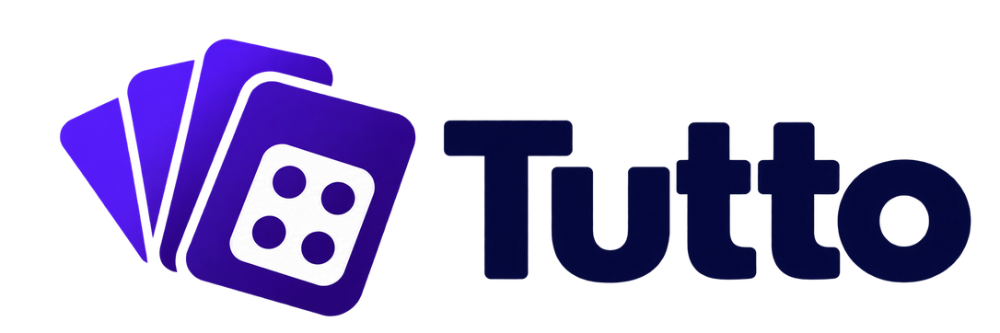

<p align="center">
  <picture>
    <source media="(prefers-color-scheme: dark)" srcset="docs/brand/tutto-wordmark-dark.png">
    
  </picture>
</p>

# Tutto Multi-Device

Play the push-your-luck card and dice game **Tutto!** with friends — online in real time, or locally on one device. A single Docker image serves the whole thing.

## Features

- **Local & online multiplayer:** play on one device, or host a room and play over the internet. Invite by link, share sheet or QR code; rooms you have joined are remembered for one-tap rejoining.
- **Two rule sets:** the app's own *Modernized* rules, or the official *Classic* rules where a Tutto lets you keep drawing cards. See [Game modes](#game-modes-modernized-vs-classic).
- **Digital or physical dice:** animated dice with staggered tumbling, or score your real dice at the table.
- **Bots and a coach:** fill seats with local bots, or turn on *Ask Otto* to see what the optimal bot would keep after every roll — it never presses a button for you.
- **Statistics & leaderboards:** global and per-device records per rule set — turns played, busts, fastest wins, highest turns, special-card success rates.
- **Accessible:** full keyboard play, screen-reader roll narration, reduced-motion support, dark mode, English and German.
- **Installable:** add to your home screen as an app after your first finished game.

## Quick start

```bash
docker run -d --name tutto -p 3001:3001 -v tutto-data:/data \
  -e API_TOKEN="$(openssl rand -hex 32)" --restart unless-stopped i7gamer/tutto:latest
```

Open `http://localhost:3001`. Configuration, backups, reverse proxies and updating are in [docs/deployment.md](docs/deployment.md); running from source and the test suites are in [docs/development.md](docs/development.md).

## How to play

The objective is to reach the winning score (default 6,000) and be the sole leader when the round ends — the round is always played to the end, so reaching the target first is no guarantee, and a tie plays on.

### The basics

1. On your turn, draw a card from the deck.
2. Roll the dice. Every roll must score something (single 1s/5s, or three of a kind).
3. Score **nothing** and you "bust": you lose the turn's points and your turn ends.
4. Score with all six dice and you have a **Tutto!** — collect the card's bonus, if it has one.

### The cards

- **x2**: a Tutto doubles your turn's score.
- **Plus/Minus**: a Tutto gives you 1,000 points and deducts 1,000 from the current leader.
- **Stop**: you cannot roll; your turn ends immediately.
- **Feuerwerk**: keep rolling as long as you score. You cannot bank manually — you stop only when you bust, and keep everything earned before that.
- **Kniffel**: roll a run from 1 through 6 for a fixed 2,000 points. You cannot stop voluntarily.
- **Kleeblatt**: two Tuttos in a row win the game outright.
- **Bonus cards (200–600)**: a Tutto adds the printed bonus to your turn.

### Game modes: Modernized vs. Classic

The host picks one rule set in the lobby. They differ in what happens after a Tutto:

- **Modernized** (default): a completed card ends your turn and banks the points. On Feuerwerk you choose which scoring dice to keep, and the Kniffel must be built as a consecutive run from 1 upward or 6 downward.
- **Classic** (official Abacusspiele rules): after any Tutto you may reveal the next card and keep rolling — points accumulate without limit, but a bust or a drawn Stop card forfeits the **whole** turn. A classic x2 doubles the entire accumulated total, a successful Plus/Minus adds exactly +1,000 (the leader deduction applies only if the turn banks, and never drops anyone below 0), Feuerwerk keeps every scoring die automatically and its ending null banks the whole turn, and any still-missing number counts toward the Kniffel.

Each rule set keeps its own statistics, records and win streaks.

### Lobby options

- **Winning score** and **deck composition** can be changed; doing so marks the game *custom*, and its statistics go into that rule set's separate custom bucket rather than the normal records.
- **Turn timer** (doubled for Kleeblatt, tripled for Feuerwerk), **kick timer** for disconnected players, random turn order and an enforced dice mode change the pacing, not what it takes to win — such games still count as normal.
- Local games record no statistics at all.

## Inviting players

A room is identified by a code you choose when you create it. Four ways to get it to someone, in rough order of how little typing they involve:

| | How | Good for |
| --- | --- | --- |
| **Invite link** | Copy button next to the room name. Opens Tutto with the code already filled in. | Chat, email, anywhere you can paste. |
| **Share sheet** | Share button, on devices that have one. Same link, handed to the OS. | Phones. |
| **QR code** | QR button. Shows the same link as a code. | Someone sitting next to you: their phone's own camera app opens it. |
| **Scanner** | Scan button beside the room-code field. | A guest who already has Tutto open. |

> **The scanner needs an https origin.** Browsers only grant camera access on secure connections, so on a plain-http LAN address it will ask you to type the code instead. The other three ways work regardless. See [Behind a reverse proxy](docs/deployment.md#behind-a-reverse-proxy) for putting the app on https.

> **A QR code is only as reachable as the address it was made from.** If you opened Tutto on `localhost`, the code points at the guest's own machine. The app says so when it spots this; open it on your network address instead.

## Keyboard shortcuts

| Key | Does |
| --- | --- |
| `Space` / `Enter` | Whatever the primary button is right now — roll the dice, end your turn, answer Yes. |
| `R` | Roll again with the dice you have selected. |
| `S` | Stop and bank the dice you have selected. |
| `A` | Select every die in the current roll that scores. |
| `D` | Draw the next card instead of banking, on the roll that completes a Tutto (Classic rules). |

Shortcuts stay out of the way while you are typing in a field or a dialog is open. The same table is in the in-app wiki, whose footer also names the running build — useful when reporting a bug against `latest` or `nightly`.

## Tech stack

React, Vite, Tailwind CSS and Framer Motion on the front; Node.js, Express and Socket.IO behind, with SQLite via Knex for statistics. Vitest and Playwright for tests. Ships as a multi-architecture Docker image (`linux/amd64`, `linux/arm64`).

**Browser support:** Safari 16.4+, Chrome 111+, Firefox 128+ — in practice an iPhone 8 or newer. Tailwind CSS 4 sets the floor; an older browser gets a broken layout rather than a plain one.

## License

Licensed under the **GNU Affero General Public License v3.0 or later** (AGPL-3.0-or-later). The full text is in [COPYING](COPYING), with the copyright notice in [NOTICE](NOTICE).

Because Tutto is played over a network, the AGPL's network clause applies: if you run a modified version as a service others can reach, you must offer them the source of your modified version.
